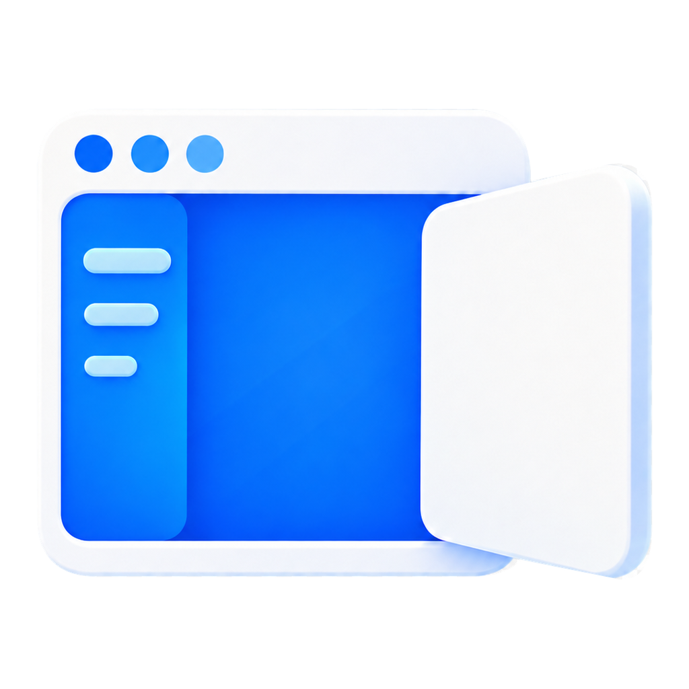
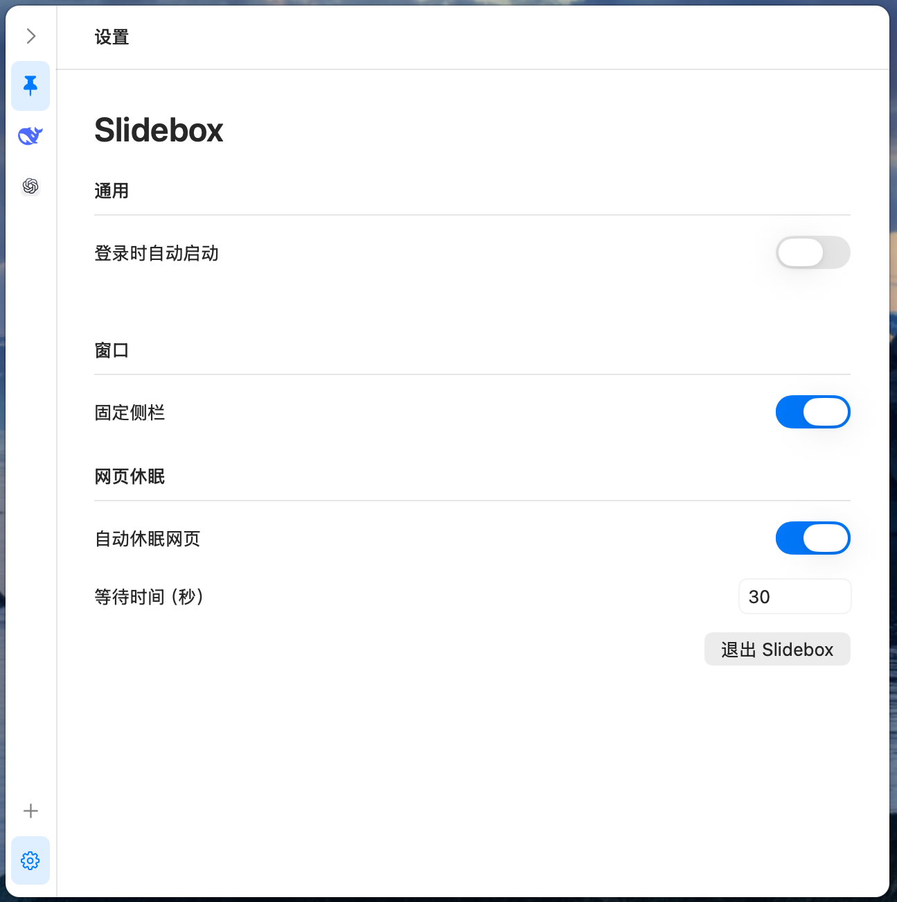

# Slidebox



免费开源的 macOS 侧栏浏览器，使用 Swift 和系统 WebKit 原生构建，专注低系统开销。

- 鼠标移到屏幕边缘即可展开，支持拖动排序、调整窗口大小和固定窗口。
- 网页隐藏后默认 30 秒休眠，释放内存；再次展开时重新加载。可关闭休眠或自定义时间。
- 不预加载网页，不轮询鼠标，无第三方代码依赖。

支持 **macOS 15+ · Apple Silicon / Intel**。

休眠保留登录数据，但未发送的输入和正在生成的回答可能丢失。

[下载](https://github.com/yuan-me/slidebox/releases/latest) · [使用说明](docs/USAGE.zh-CN.md) · [MIT License](LICENSE)

---

A free, open-source macOS sidebar browser built with Swift and system WebKit for low system overhead.

- Hover at the screen edge to open. Drag to reorder websites, resize the window, or pin it in place.
- Hidden pages sleep after 30 seconds to free memory and reload when reopened. Turn sleep off or set your own delay.
- No webpage preloading, mouse polling, or third-party code dependencies.

Requires **macOS 15+ · Apple Silicon / Intel**.

Sleep keeps login data, but unsent input and responses still being generated may be lost.

[Download](https://github.com/yuan-me/slidebox/releases/latest) · [MIT License](LICENSE)

## 截图 / Screenshots

| 主窗口 / Main | 设置 / Settings | 添加网站 / Add website |
| --- | --- | --- |
| [](docs/screenshots/main.png) | [](docs/screenshots/settings.png) | [](docs/screenshots/add-website.png) |

## 构建 / Build

Swift 6+ / Apple Command Line Tools

```sh
bash scripts/build.sh
```

→ `dist/Slidebox.app`
